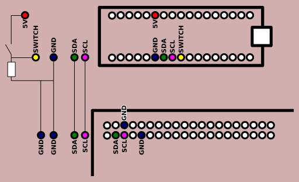

# i2ckeyboard

This is a proof of principle project, demonstrating the transmission of keyboard
key events via i2c from a Raspberry Pi to an Arduino Micro. The key events are
then recreated on the HID interface of the Arduino Micro.

This project is published as a reference project. It is not to be considered
"ready to use", but may hold valuable hints for others trying to do similar
things. Have fun!


## Setup

### Hardware



The Raspberry Pi has pull up resistors included on the Board for 3.3V, while the Arduino Micro has software enabled pull ups to 5V. The Wire library enables the pull ups on default (!) and they need to be disabled to not damage the 3.3V logic of the Raspberry Pi (see [Raspberry Pi and Arduino Connected Using I2C](https://oscarliang.com/raspberry-pi-arduino-connected-i2c/)!

The pins for GND, SDA and SCL are connected directly between the boards. The hardware switch is connecting ground and 5V via a 10k Ohm pull up resistor. The Arduino port 4 (or whatever port you like) is connected inbetween the hardware switch and the resistor.


### Software Requirements

* Arduino Micro, Arduino API 1.8.5
  * HID-Project 2.4.4
  * Wire 1.0.0
* Raspberry Pi 3 B, Raspian 2017-09-07-raspbian-stretch-lite.img
  * Python 3.5.3
    * time
    * sys
    * argparse
    * termios
    * tty
    * logging
    * smbus 3.1.2-3
    * asyncio 3.4.3
    * evdev 0.7.0

### Raspberry Pi configuration changes

This section represents the status as of Nov 18, 2017

#### Limit number of virtual consoles available to a single one

A common key combination is Alt-F4 to close windows. It does not help, if your
pi is switching virtual consoles in the mean time. by having only one, this is
easily solved. Most of the programming is more easily performed via ssh
anyways.

I tried multiple aproaches, but none where working as expected. The result of

```
dumpkeys
```

was way too complex to change for this task.

```
ln -d /dev/null /etc/systemd/system/getty.target.wants/getty@tty2.service
```

would disable the getty, but not prevent switching to tty2.

I am open for solutions, but as I am finally aiming at an X based application,
I will stop research into the problem here. This problem seems to be largely
unsolved.


#### Disable reboot on Ctrl-Alt-Del

By default, the Raspberry Pi reboots on Ctrl-Alt-Del. If the goal is, to
transmit most of the common key combinations, we cannot allow this operating
system to act on key strokes. So let's diable it.

```
root@lcars:/home/pi# systemctl mask ctrl-alt-del
```

should have done the job, but it didn't at all. Raspbian is doing some funny
things.

```
root@lcars:/lib/systemd/system# ls -l ctrl*
lrwxrwxrwx 1 root root 13 Jul  5 22:31 ctrl-alt-del.target -> reboot.target
root@lcars:/lib/systemd/system# rm ctrl-alt-del.target 
root@lcars:/lib/systemd/system# ln -s /dev/null ctrl-alt-del.target
root@lcars:/lib/systemd/system# ls -l ctrl*
lrwxrwxrwx 1 root root 9 Nov 18 19:59 ctrl-alt-del.target -> /dev/null
root@lcars:/lib/systemd/system# systemctl daemon-reload
```

is solving the problem.

[http://raspberrycompote.blogspot.de/](http://raspberrycompote.blogspot.de/2016/02/modifying-ctrlaltdel-behavior-in-debian.html)

## i2c communication protocol

data transport protocol to transport key press and release information via i2c
bus with checksums and error detection

7|6|5|4|3|2|1|0
-|-|-|-|-|-|-|-
MSB|||||||LSB

__KEY-ID - Byte__
* 0-7: 8 Bit unsignet int key id to be transmitted via the USB keyboard
  
__ACTION - Byte__
* 0-3: Checksum summing all bits = 1 of the KEY-ID(0-7) and ACTION(4-7)
* 4-5: Key action to be performed
  * 00  Transmission test, no action on ext. keyboard. Set LED status and receive status
  * 01  Press Key
  * 10  Release Key
  * 11  Release all
* 6: Set connect LED (0 turn LED off, 1 turn LED on)
* 7: uneven bit - force number of bits = 1 to be uneven (KEY-ID(0-7) + ACTION(4-7))
    
__CONFIRM - Byte__
* 0-3: Checksum summing all bits = 1 of the KEY-ID(0-7) and the ACTION(0-7)
* 4: Status of connect LED
* 5: Status of hardware switch
* 6: checksum / execution error (0: no error, 1: error)
* 7: uneven bit - force number of bits = 1 of confirm byte to be uneven

## Acknowledgement

Special thanks goes out to [@NicoHood](https://github.com/NicoHood)
[http://www.nicohood.de](http://www.nicohood.de) for his great
[HID-Project](https://github.com/NicoHood/HID) and
[@donid](https://github.com/donid) for his
[akuhell](https://github.com/donid/akuhell) insight into arduino keyboard
keylayout translation. After two weeks of continuous spare time work on getting
German keyboard layout work, stumbling upon akuhell opened some eyes.

Another special thanks goes out to Oscar Liang for his extensive article on
[Raspberry Pi and Arduino Connected Using
I2C](https://oscarliang.com/raspberry-pi-arduino-connected-i2c/). The
explanation saved the Raspberry Pi input ports from beeing fried. This is a
recommendet reading for anyone connecting a Pi and an Arduino via i2c/TWI.

Thanks to all Open Source and Open Hardware providers that allow me to play 
around on this high meta level of creating new applications!
